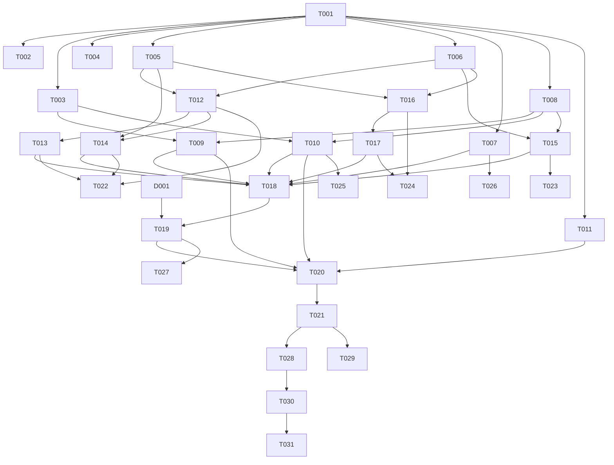

# Implementation Plan

## Project Overview
Build `src/doc_sync.py` (or `src/doc_sync/` package), a local, standalone CLI tool that watches `src/` for `.py` file changes (via `watchdog`), extracts module/function structure via `ast`, and rewrites clearly-delimited auto-generated sections of `README.md` using rule-based templates — while preserving hand-written content, never executing scanned code, and staying resilient to per-file failures. Entry point: `python -m src.doc_sync --watch`.

## Planning Context

### Input Documents
- Requirements: `artifacts/requirements.md` — 5 functional requirements (file watcher, AST extraction, marker-based README sync, stale-doc removal, warning logging) and 5 NFRs (performance, security, scalability, usability, reliability).
- Architecture: `artifacts/architecture.md` — single-process, event-driven CLI with 8 components: File Watcher, Event Debouncer, Sync Orchestrator, AST Extractor, Markdown Renderer, README Sync Writer, Path Validator, Logger.
- Design Review: `artifacts/design-review.md` — **APPROVED WITH CONDITIONS**: 1 Critical, 2 High, 4 Medium, 3 Low findings; verdict rationale cites correct scoping but flags a stale-doc cold-start gap, a Path Validator wiring inconsistency, and an unaddressed debounce concurrency risk.

### Planning Date
2026-09-03

### Critical Findings to Resolve Before Implementation
- **C-1**: No reconciliation of orphaned README blocks against currently-existing `src/` files at startup (FR-4 gap). Requires a human decision on log-message behavior before the resolving task starts — see **D001**.

*(H-1 and H-2 are High, not Critical, but are explicitly built into Layer 2/3 tasks below rather than deferred — see T007/T009/T010/T018.)*

---

## Implementation Layers

### Layer 0 — Infrastructure Setup
Project skeleton, dependency pinning (resolves M-1/L-3), logging bootstrap, and pytest scaffolding. Tasks: T001–T004.

### Layer 1 — Core Utilities & Models
Exception hierarchy, `ModuleInfo`/`FunctionInfo` dataclasses, the canonical Path Validator utility (resolves H-1's wiring ambiguity by defining a single call contract), and shared constants (including an injectable debounce window, addressing L-1). Tasks: T005–T008.

### Layer 2 — Integration Layer
File Watcher (`watchdog` wrapper) and a thread-safe Event Debouncer (resolves H-2), plus the CLI argument-parsing skeleton. Tasks: T009–T011.

### Layer 3 — Business Logic Components
AST Extractor (base extraction, then posonly/kwonly args per M-3, then strict-UTF-8/`ExtractionError` per M-2), Markdown Renderer, README Sync Writer (marker parsing, then insert/replace/remove + atomic write), and the Sync Orchestrator (targeted sync with per-file Path Validator invocation resolving H-1, then startup full sync + orphan reconciliation resolving C-1, gated on D001). Tasks: T012–T019.

### Layer 4 — Interface Layer
Full CLI lifecycle wiring: observer start, `SIGINT` handling with `stop()`+`join()` (resolves L-2), clean exit code 0, and end-to-end pipeline wiring with NFR-4 log messages. Tasks: T020–T021.

### Layer 5 — Testing & Quality (parallel to Layers 1–4 as components complete)
Unit tests per component (including debounce thread-safety per H-2, and startup reconciliation per C-1) and one integration test of the full watch-trigger-sync cycle. Tasks: T022–T028.

### Layer 6 — Documentation & Refinement (final layer)
Docstrings, README usage instructions, and the M-4 unsaved-editor-changes advisory note. Tasks: T029–T031.

---

## Task Details

### Layer 0 — Infrastructure Setup

#### T001: Set Up Project Structure & Package Skeleton
- **Description**: Create the `src/doc_sync/` package skeleton per Architecture §12.1: `__init__.py`, `__main__.py`, `watcher.py`, `orchestrator.py`, `extractor.py`, `renderer.py`, `readme_writer.py`, `errors.py`, `models.py`, `path_validator.py`, `debouncer.py`, `constants.py`, `logger.py` — each as an empty module with a one-line module docstring stating its Section 2.3 responsibility.
- **Component**: Code Organization (Architecture §12.1)
- **Requirements Addressed**: Technical Requirements (project structure)
- **Dependencies**: None
- **Estimated Effort**: Small (3 hours)
- **Acceptance Criteria**:
  - [ ] `src/doc_sync/` package importable via `python -c "import src.doc_sync"`
  - [ ] All module stub files exist with correct names and docstrings
  - [ ] `tests/` directory exists alongside `src/`
- **Files to Create**: `src/doc_sync/__init__.py`, `src/doc_sync/__main__.py`, `src/doc_sync/watcher.py`, `src/doc_sync/debouncer.py`, `src/doc_sync/orchestrator.py`, `src/doc_sync/extractor.py`, `src/doc_sync/renderer.py`, `src/doc_sync/readme_writer.py`, `src/doc_sync/errors.py`, `src/doc_sync/models.py`, `src/doc_sync/path_validator.py`, `src/doc_sync/constants.py`, `src/doc_sync/logger.py`
- **Design Review Considerations**: None directly; establishes the module boundaries used to resolve H-1 later.
- **Testing Notes**: N/A (structural task).

#### T002: Pin Dependencies & Minimum Python Version
- **Description**: Update `requirements.txt` to pin `watchdog` to a specific compatible range and declare a minimum Python version.
- **Component**: Technology Stack (Architecture §3.5, §12.1)
- **Requirements Addressed**: Technical Requirements (Technology Stack)
- **Dependencies**: T001
- **Estimated Effort**: Small (2 hours)
- **Acceptance Criteria**:
  - [ ] `requirements.txt` contains `watchdog>=4.0,<5.0`
  - [ ] `pyproject.toml`/`setup.cfg` (or README) states `Requires-Python >=3.10`
  - [ ] `pip install -r requirements.txt` succeeds in a clean venv
- **Files to Create/Modify**: `requirements.txt`, `pyproject.toml` (or `setup.cfg`)
- **Design Review Considerations**: Resolves **M-1** (unpinned dependency) and **L-3** (unspecified Python minimum).
- **Testing Notes**: Verify via `pip install -r requirements.txt --dry-run` or a fresh venv install.

#### T003: Configure Logging Infrastructure
- **Description**: Implement `logger.py` with a stdlib `logging.getLogger(__name__)`-based setup, a `StreamHandler` to stdout/stderr, and a plain single-line formatter matching NFR-4 (`%(asctime)s %(levelname)s %(message)s`).
- **Component**: Logger (Architecture §2.3)
- **Requirements Addressed**: NFR-4
- **Dependencies**: T001
- **Estimated Effort**: Small (3 hours)
- **Acceptance Criteria**:
  - [ ] `configure_logging()` sets up root/named logger with correct format
  - [ ] `INFO` and `WARNING` levels both render distinctly
  - [ ] Unit test asserts log line format via `caplog`
- **Files to Create**: `src/doc_sync/logger.py`
- **Files to Modify**: N/A
- **Design Review Considerations**: Supports FR-5 warning visibility.
- **Testing Notes**: Use `pytest`'s `caplog` fixture; assert message includes file path + exception text once T012/T018 are wired in.

#### T004: Set Up Testing Framework
- **Description**: Add `pytest` configuration (`pytest.ini` or `pyproject.toml [tool.pytest]`), a `tests/conftest.py` with fixtures for a temp `src/` tree and temp `README.md`, and an empty `tests/test_doc_sync.py` placeholder.
- **Component**: Testing Requirements (Architecture §12.2)
- **Requirements Addressed**: General (quality gate for all FRs)
- **Dependencies**: T001
- **Estimated Effort**: Small (3 hours)
- **Acceptance Criteria**:
  - [ ] `pytest` runs successfully with zero collected tests (no errors)
  - [ ] `conftest.py` provides `tmp_src_dir` and `tmp_readme` fixtures using `tmp_path`
- **Files to Create**: `pytest.ini` (or `pyproject.toml` section), `tests/conftest.py`, `tests/test_doc_sync.py`
- **Design Review Considerations**: Enables L-1 (injectable debounce window) test strategy.
- **Testing Notes**: Fixtures must not touch the real repo `src/`/`README.md`.

---

### Layer 1 — Core Utilities & Models

#### T005: Implement Exception Hierarchy
- **Description**: Implement `DocSyncError` (base), `ExtractionError`, and `ReadmeSyncError` in `errors.py` per Architecture §5.3.
- **Component**: Error Handling (Architecture §5.3)
- **Requirements Addressed**: FR-5
- **Dependencies**: T001
- **Estimated Effort**: Small (2 hours)
- **Acceptance Criteria**:
  - [ ] `ExtractionError` and `ReadmeSyncError` both subclass `DocSyncError`
  - [ ] Each exception accepts a message and preserves it via `str(exc)`
  - [ ] Unit test instantiates and raises each type
- **Files to Create**: `src/doc_sync/errors.py`
- **Design Review Considerations**: Foundational for M-2 (strict decode → `ExtractionError`).
- **Testing Notes**: Simple `pytest.raises` checks.

#### T006: Implement `ModuleInfo`/`FunctionInfo` Data Models
- **Description**: Implement the two dataclasses per Architecture §4.1: `ModuleInfo(module_path, docstring, functions)`, `FunctionInfo(name, signature, docstring)`.
- **Component**: Data Architecture (Architecture §4.1)
- **Requirements Addressed**: FR-2, Technical Requirements (Data Models)
- **Dependencies**: T001
- **Estimated Effort**: Small (3 hours)
- **Acceptance Criteria**:
  - [ ] Both are `@dataclass` with correct field types (`str`, `str | None`, `list[FunctionInfo]`)
  - [ ] Equality comparison works (for idempotency tests later)
  - [ ] Unit test constructs instances with and without docstrings
- **Files to Create**: `src/doc_sync/models.py`
- **Design Review Considerations**: None directly.
- **Testing Notes**: Verify `==` works for two structurally-identical instances (needed by T023's idempotency test).

#### T007: Implement Path Validator
- **Description**: Implement `is_within_workspace(path: Path, root: Path) -> bool` in `path_validator.py`, resolving each candidate with `Path.resolve()` and checking containment under `root`. Document in its module docstring that this is a **single shared utility invoked only by the Sync Orchestrator, immediately before any file is opened**, for both watchdog-triggered and startup-enumerated paths — never wired directly into the watcher or debouncer.
- **Component**: Path Validator (Architecture §2.3, §6.3)
- **Requirements Addressed**: NFR-2
- **Dependencies**: T001
- **Estimated Effort**: Small (3 hours)
- **Acceptance Criteria**:
  - [ ] Returns `True` for paths inside `root`, `False` for paths outside (including via `..` traversal and symlinks pointing outside)
  - [ ] Pure function, no file I/O side effects beyond `resolve()`
  - [ ] Docstring explicitly states the single call-site contract (Sync Orchestrator, per-file, pre-open)
- **Files to Create**: `src/doc_sync/path_validator.py`
- **Design Review Considerations**: Establishes the contract that **resolves H-1** at the code level; actual call-site wiring happens in T018.
- **Testing Notes**: Test with a symlink fixture pointing outside `tmp_path` if the OS/test environment supports it; otherwise use `..`-relative traversal paths.

#### T008: Define Constants & Configuration Module
- **Description**: Implement `constants.py` with the marker template strings (`AUTO-DOC:START module={module}` / `END`), the `## API Reference` heading constant, and a `DEFAULT_DEBOUNCE_WINDOW_MS` constant that is **overridable via a constructor parameter** in the Event Debouncer (not hardcoded), addressing L-1's testability concern.
- **Component**: Markdown Renderer, Event Debouncer, README Sync Writer (shared constants)
- **Requirements Addressed**: FR-3, NFR-1
- **Dependencies**: T001
- **Estimated Effort**: Small (2 hours)
- **Acceptance Criteria**:
  - [ ] Marker regex/format strings centralized in one module (no duplicated literals across renderer/writer)
  - [ ] `DEFAULT_DEBOUNCE_WINDOW_MS` documented as overridable
- **Files to Create**: `src/doc_sync/constants.py`
- **Design Review Considerations**: Enables **L-1** resolution (injectable debounce window) in T010/T025.
- **Testing Notes**: N/A (constants only).

---

### Layer 2 — Integration Layer

#### T009: Implement File Watcher
- **Description**: Implement `watcher.py` with a `watchdog.observers.Observer` and a custom `FileSystemEventHandler` subclass that filters to `.py` files only and emits normalized `ChangeEvent(path, kind)` objects to a callback/queue consumed by the Event Debouncer.
- **Component**: File Watcher (Architecture §2.3)
- **Requirements Addressed**: FR-1, NFR-1
- **Dependencies**: T001, T003
- **Estimated Effort**: Medium (6 hours)
- **Acceptance Criteria**:
  - [ ] Recursive watch on a given root directory
  - [ ] `.py` create/modify/delete events produce `ChangeEvent`; non-`.py` events are dropped
  - [ ] No polling loop is used (Observer-based only)
- **Files to Create**: `src/doc_sync/watcher.py`
- **Design Review Considerations**: Feeds the Event Debouncer, not the Path Validator directly (per H-1 resolution — validation happens later, in the Orchestrator).
- **Testing Notes**: Use `watchdog`'s in-memory testing utilities or a real temp directory with short-lived file writes; assert event kind/path correctness.

#### T010: Implement Thread-Safe Event Debouncer
- **Description**: Implement `debouncer.py` using a `queue.Queue` (or a `threading.Lock`-guarded `set[Path]`) to buffer incoming `ChangeEvent`s from the watchdog background thread, deduplicate paths within an injectable window (`DEFAULT_DEBOUNCE_WINDOW_MS` from T008, overridable via constructor), and atomically swap/clear the buffer under lock before handing the batch to the Sync Orchestrator via `threading.Timer`.
- **Component**: Event Debouncer (Architecture §2.3)
- **Requirements Addressed**: NFR-1, NFR-5
- **Dependencies**: T003, T008
- **Estimated Effort**: Medium (6 hours)
- **Acceptance Criteria**:
  - [ ] Buffer access is fully guarded (no unsynchronized read/write across the event-handler thread and timer-callback thread)
  - [ ] Rapid duplicate events for the same path within the window collapse to one entry
  - [ ] Constructor accepts a `window_ms` parameter overriding the default
  - [ ] Concurrency stress test (T025) passes with no lost/duplicated/corrupted entries
- **Files to Create**: `src/doc_sync/debouncer.py`
- **Design Review Considerations**: **Resolves H-2** (thread-safety mechanism for the debounce buffer). Also resolves **L-1** (injectable window for tests).
- **Testing Notes**: T025 must spawn multiple producer threads writing to the buffer concurrently with a timer callback draining it, asserting no exceptions and correct final batch contents.

#### T011: Implement CLI Argument-Parsing Skeleton
- **Description**: Implement `__main__.py` with `argparse` supporting `--watch` (only supported flag this iteration) and a `if __name__ == "__main__":` guard. Full lifecycle wiring (observer start/stop, SIGINT) is deferred to T020; this task only establishes argument parsing and help text.
- **Component**: CLI Interface (Architecture §5.1)
- **Requirements Addressed**: FR-1, NFR-4
- **Dependencies**: T001
- **Estimated Effort**: Small (3 hours)
- **Acceptance Criteria**:
  - [ ] `python -m src.doc_sync --help` shows usage and the `--watch` flag
  - [ ] Missing `--watch` (no other mode defined) produces a clear usage message
- **Files to Create/Modify**: `src/doc_sync/__main__.py`
- **Design Review Considerations**: None directly.
- **Testing Notes**: Test via `subprocess` or `argparse.parse_args` unit call with `["--watch"]` and `[]`.

---

### Layer 3 — Business Logic Components

#### T012: Implement AST Extractor — Core Extraction
- **Description**: Implement `extract_module(path: Path) -> ModuleInfo` in `extractor.py`: read file, `ast.parse(source, filename=path)`, extract module docstring, walk top-level `ast.FunctionDef` nodes only (excluding nested functions and class bodies), and build `FunctionInfo` entries with name, a basic rendered signature (positional args, defaults, `*args`, `**kwargs`, return annotation), and docstring.
- **Component**: AST Extractor (Architecture §2.3)
- **Requirements Addressed**: FR-2
- **Dependencies**: T005, T006
- **Estimated Effort**: Medium (8 hours)
- **Acceptance Criteria**:
  - [ ] Module docstring extracted or `None` if absent
  - [ ] Only module-level `def`s extracted; nested functions and class methods excluded
  - [ ] `SyntaxError` during `ast.parse` raises `ExtractionError` (not a bare exception)
  - [ ] Unit tests cover: no docstring, multiple functions, `*args`/`**kwargs`, nested function exclusion, class exclusion
- **Files to Create/Modify**: `src/doc_sync/extractor.py`
- **Design Review Considerations**: Baseline for M-2/M-3 follow-ups (T013, T014).
- **Testing Notes**: Use literal source strings via `tmp_path`-written `.py` files; assert `ModuleInfo` equality against expected fixtures.

#### T013: Extend AST Extractor for `posonlyargs`/`kwonlyargs`
- **Description**: Extend the signature renderer in `extractor.py` to explicitly handle `ast.arguments.posonlyargs` (rendering a trailing `/`) and `kwonlyargs`/`kw_defaults` (rendering a leading bare `*` when present and no `vararg`), plus `kwarg`, per the full five `ast.arguments` component groups.
- **Component**: AST Extractor (Architecture §2.3)
- **Requirements Addressed**: FR-2
- **Dependencies**: T012
- **Estimated Effort**: Small (3 hours)
- **Acceptance Criteria**:
  - [ ] Function with `def f(a, b, /, c, *, d=1, **kw)` renders a signature string containing `/`, `*`, and correct defaults
  - [ ] Unit tests cover posonly-only, kwonly-only, and combined cases
- **Files to Modify**: `src/doc_sync/extractor.py`
- **Design Review Considerations**: **Resolves M-3**.
- **Testing Notes**: Table-driven test with multiple signature shapes compared against expected rendered strings.

#### T014: Implement Strict UTF-8 Decoding with `ExtractionError`
- **Description**: Replace ad-hoc/"tolerant" file reading with explicit `open(path, encoding="utf-8", errors="strict")`; catch `UnicodeDecodeError` and re-raise as `ExtractionError` with the file path and original message, so it is caught and logged as a `WARNING` upstream (not silently substituted).
- **Component**: AST Extractor (Architecture §2.3)
- **Requirements Addressed**: FR-2, FR-5
- **Dependencies**: T012, T005
- **Estimated Effort**: Small (2 hours)
- **Acceptance Criteria**:
  - [ ] A file with invalid UTF-8 bytes raises `ExtractionError` (not silently decoded with replacement characters)
  - [ ] Error message includes the file path and the original decode error text
  - [ ] Unit test writes a file with invalid UTF-8 bytes and asserts the raised exception type/message
- **Files to Modify**: `src/doc_sync/extractor.py`
- **Design Review Considerations**: **Resolves M-2**.
- **Testing Notes**: Write raw invalid bytes via `path.write_bytes(b"\xff\xfe...")` in the test fixture.

#### T015: Implement Markdown Renderer
- **Description**: Implement `render_block(module_info: ModuleInfo) -> str` in `renderer.py`: render the module dotted path as a subheading wrapped in the `<!-- AUTO-DOC:START/END module=X -->` markers (from `constants.py`), the module docstring, and each function as a subheading/bullet with its signature as a code span and docstring text. Must be deterministic (identical input → byte-identical output).
- **Component**: Markdown Renderer (Architecture §2.3)
- **Requirements Addressed**: FR-3
- **Dependencies**: T006, T008
- **Estimated Effort**: Medium (5 hours)
- **Acceptance Criteria**:
  - [ ] Same `ModuleInfo` rendered twice produces byte-identical strings
  - [ ] Output includes correctly-formed start/end markers with the module's dotted path
  - [ ] Functions with `None` docstring render without a stray placeholder
  - [ ] Unit test asserts idempotency and marker correctness
- **Files to Create/Modify**: `src/doc_sync/renderer.py`
- **Design Review Considerations**: Supports FR-3's no-diff-on-rerun success criterion.
- **Testing Notes**: T023 covers idempotency explicitly across two renders of the same fixture.

#### T016: Implement README Sync Writer — Marker Parsing
- **Description**: Implement marker-pair detection in `readme_writer.py`: parse `README.md` content to locate `<!-- AUTO-DOC:START module=X -->`/`END` pairs, build a `module -> (start_idx, end_idx)` map, and validate integrity (no unmatched or duplicated markers per module); on malformation, mark that module as skip-with-warning rather than guessing.
- **Component**: README Sync Writer (Architecture §2.3)
- **Requirements Addressed**: FR-3, FR-4
- **Dependencies**: T005, T006
- **Estimated Effort**: Medium (6 hours)
- **Acceptance Criteria**:
  - [ ] Correctly locates zero, one, and multiple existing marker pairs
  - [ ] Detects unmatched start/end and duplicate module keys, returning a distinguishable "malformed" result per module
  - [ ] Unit tests cover well-formed, malformed, and no-markers-present README content
- **Files to Create/Modify**: `src/doc_sync/readme_writer.py`
- **Design Review Considerations**: Supports the requirements' risk mitigation (malformed markers → skip + warn).
- **Testing Notes**: Use literal multi-line README fixtures as test input strings.

#### T017: Implement README Sync Writer — Insert/Replace/Remove + Atomic Write
- **Description**: Implement `sync_readme(readme_path: Path, blocks: dict[str, str | None]) -> SyncResult`: for each changed module, replace its block content in place or append a new block (under `## API Reference` if present, else end of file); for each module mapped to `None`, remove its entire block including markers; write via temp file in the same directory + `os.replace()` for atomicity.
- **Component**: README Sync Writer (Architecture §2.3, Decision 5)
- **Requirements Addressed**: FR-3, FR-4, NFR-5
- **Dependencies**: T016
- **Estimated Effort**: Medium (5 hours)
- **Acceptance Criteria**:
  - [ ] New module block appended correctly (under `## API Reference` if present)
  - [ ] Existing block replaced in place with surrounding content untouched
  - [ ] Block removed entirely (including markers) when mapped to `None`
  - [ ] Write uses temp-file + `os.replace()` (verified by mocking/inspecting the write sequence)
  - [ ] Unit tests cover all four scenarios plus a simulated interruption (temp file left behind, original untouched)
- **Files to Modify**: `src/doc_sync/readme_writer.py`
- **Design Review Considerations**: Implements Decision 5 (atomic writes).
- **Testing Notes**: T024 exercises insert/replace/remove/malformed-marker paths end-to-end.

#### T018: Implement Sync Orchestrator — Targeted Sync Pipeline
- **Description**: Implement `orchestrator.py`'s core pipeline: given a debounced batch of changed/deleted paths, for each path call `is_within_workspace` (T007) **before** any file is opened; for changed files call the AST Extractor → Markdown Renderer → collect into a `blocks` dict; for deleted files map to `None`; call `sync_readme`; catch `ExtractionError`/`ReadmeSyncError` per file and log a `WARNING` (path + message) without aborting the batch. Update Architecture §4.2's implied flow so Path Validator runs per-file from the Orchestrator for this path too (not from the raw watchdog/debounce pipeline).
- **Component**: Sync Orchestrator (Architecture §2.3, §4.2)
- **Requirements Addressed**: FR-1, FR-4, FR-5, NFR-2
- **Dependencies**: T007, T009, T010, T012, T013, T014, T015, T017
- **Estimated Effort**: Large (8 hours)
- **Acceptance Criteria**:
  - [ ] Every file path (from a live debounced batch) is validated via `is_within_workspace` before being opened by the Extractor
  - [ ] A path outside the workspace root is rejected and logged, never opened
  - [ ] Per-file extraction/render/write errors are caught and logged; other files in the batch still process
  - [ ] Deletions in the batch map to block removal via `sync_readme`
  - [ ] Unit/integration tests confirm Path Validator is invoked exactly once per file, at the Orchestrator level
- **Files to Create/Modify**: `src/doc_sync/orchestrator.py`
- **Design Review Considerations**: **Resolves H-1** — Path Validator is now demonstrably wired only at the Orchestrator's per-file boundary, consistent for both live-event and (in T019) startup-enumerated paths.
- **Testing Notes**: T022/T027/T028 build on this; mock the Extractor/Renderer/Writer to isolate Orchestrator branching logic.

#### T019: Implement Sync Orchestrator — Startup Full Sync + Orphan Reconciliation
- **Description**: Implement the startup path: enumerate all `.py` files under `src/` (validated via `is_within_workspace`, same as T018's per-file contract), run the full extract→render→write pipeline for each, **then** parse existing `<!-- AUTO-DOC:START module=X -->` blocks already present in `README.md`, compute the set difference against currently-enumerated modules, and route any module present in `README.md` but absent on disk to `sync_readme` for removal — per **D001**'s resolved logging behavior.
- **Component**: Sync Orchestrator (Architecture §2.3)
- **Requirements Addressed**: FR-4, NFR-5
- **Dependencies**: T018, D001
- **Estimated Effort**: Medium (5 hours)
- **Acceptance Criteria**:
  - [ ] Startup enumerates all `.py` files under `src/` and runs a full sync pass
  - [ ] Startup additionally parses existing README marker blocks and computes `README modules − disk modules`
  - [ ] Any orphaned module block is removed on the same startup pass (not deferred to a live event)
  - [ ] Log message behavior for orphan-at-startup matches D001's decision
  - [ ] Unit test: pre-populate a README with a marker block for a module whose `.py` file does not exist; assert startup sync removes it
- **Files to Modify**: `src/doc_sync/orchestrator.py`
- **Design Review Considerations**: **Resolves C-1** (startup reconciliation of orphaned README blocks). Blocked on **D001**.
- **Testing Notes**: T027 covers this scenario explicitly, including the "watcher never ran between deletion and restart" case from the requirements' NFR-5 discussion.

---

### Layer 4 — Interface Layer

#### T020: Wire CLI Full Lifecycle (Start/Stop/SIGINT)
- **Description**: Complete `__main__.py`'s `--watch` mode: on startup, run T019's full sync + reconciliation, then start the `watchdog` `Observer` (T009) wired through the Debouncer (T010) to the Orchestrator's targeted sync (T018); register a `SIGINT` handler that calls `observer.stop()` followed by `observer.join()` before process exit with code `0`.
- **Component**: CLI Interface (Architecture §5.1, §8.3)
- **Requirements Addressed**: FR-1, NFR-5
- **Dependencies**: T009, T010, T011, T019
- **Estimated Effort**: Small (4 hours)
- **Acceptance Criteria**:
  - [ ] `python -m src.doc_sync --watch` runs the startup reconciliation pass, then blocks watching for events
  - [ ] `Ctrl+C` triggers `observer.stop()` + `observer.join()` and exits with code `0`
  - [ ] No leaked OS-level watch handles after exit (verified via process/test harness where feasible)
- **Files to Modify**: `src/doc_sync/__main__.py`
- **Design Review Considerations**: **Resolves L-2** (observer cleanup on shutdown).
- **Testing Notes**: Use `subprocess.Popen` + `signal.SIGINT` in an integration test, or directly unit-test the shutdown handler function in isolation.

#### T021: Wire End-to-End Pipeline & NFR-4 Logging
- **Description**: Connect all components into the full data flow (`watchdog event → Debouncer → Orchestrator → [Path Validator, AST Extractor, Markdown Renderer, README Sync Writer] → Logger`) and ensure `INFO` logs clearly state sync pass start, which files changed, and which doc sections were added/updated/removed, per NFR-4.
- **Component**: Full pipeline (Architecture §4.2)
- **Requirements Addressed**: NFR-4, FR-1
- **Dependencies**: T020
- **Estimated Effort**: Medium (5 hours)
- **Acceptance Criteria**:
  - [ ] A manual end-to-end run (add/modify/delete a function in a test `src/` file) updates `README.md` within 2 seconds (NFR-1) and logs clear `INFO` lines for each phase
  - [ ] Log lines distinguish added/updated/removed sections
- **Files to Modify**: `src/doc_sync/orchestrator.py`, `src/doc_sync/logger.py`
- **Design Review Considerations**: Confirms NFR-4 log clarity end-to-end.
- **Testing Notes**: Feeds directly into T028's integration test.

---

### Layer 5 — Testing & Quality

#### T022: Unit Tests — AST Extractor Edge Cases
- **Description**: Comprehensive tests for `extract_module`: module without docstring, functions with all signature variants, nested-function/class exclusion, syntax error → `ExtractionError`, invalid UTF-8 → `ExtractionError`.
- **Component**: AST Extractor
- **Requirements Addressed**: FR-2, FR-5
- **Dependencies**: T012, T013, T014
- **Estimated Effort**: Medium (5 hours)
- **Acceptance Criteria**:
  - [ ] All acceptance criteria from T012/T013/T014 have a corresponding passing test
  - [ ] `pytest tests/test_extractor.py -v` passes
- **Files to Create**: `tests/test_extractor.py`
- **Design Review Considerations**: Verifies M-2, M-3 resolutions.

#### T023: Unit Tests — Markdown Renderer Idempotency
- **Description**: Test `render_block` for deterministic/idempotent output and correct marker formatting across varied `ModuleInfo` inputs (no docstring, no functions, many functions).
- **Component**: Markdown Renderer
- **Requirements Addressed**: FR-3
- **Dependencies**: T015
- **Estimated Effort**: Small (3 hours)
- **Acceptance Criteria**:
  - [ ] Two renders of the same `ModuleInfo` are byte-identical
  - [ ] Marker start/end lines contain the correct module key
- **Files to Create**: `tests/test_renderer.py`

#### T024: Unit Tests — README Sync Writer
- **Description**: Test insert (no existing block), replace (existing block), remove (module deleted), and malformed-marker skip-with-warning scenarios, plus atomic-write behavior.
- **Component**: README Sync Writer
- **Requirements Addressed**: FR-3, FR-4, NFR-5
- **Dependencies**: T016, T017
- **Estimated Effort**: Medium (5 hours)
- **Acceptance Criteria**:
  - [ ] All four scenarios from T016/T017 have passing tests
  - [ ] Malformed-marker case logs a warning and leaves the module's block untouched
- **Files to Create**: `tests/test_readme_writer.py`

#### T025: Unit Tests — Event Debouncer Thread-Safety
- **Description**: Spawn multiple producer threads writing `ChangeEvent`s into the debouncer concurrently with the timer callback draining the buffer using an injected near-zero `window_ms`; assert no exceptions, no lost/duplicated paths, and correct final batch contents.
- **Component**: Event Debouncer
- **Requirements Addressed**: NFR-1, NFR-5
- **Dependencies**: T010
- **Estimated Effort**: Medium (4 hours)
- **Acceptance Criteria**:
  - [ ] Test runs with ≥4 concurrent producer threads and repeats ≥50 iterations without a race-condition failure
  - [ ] Uses the injectable `window_ms` (T008/T010) to avoid real sleeps
- **Files to Create**: `tests/test_debouncer.py`
- **Design Review Considerations**: Directly verifies **H-2**'s resolution; also verifies **L-1**'s injectable-window fix.

#### T026: Unit Tests — Path Validator
- **Description**: Test `is_within_workspace` for paths inside root, `..`-traversal paths, and (where supported) symlinks pointing outside root.
- **Component**: Path Validator
- **Requirements Addressed**: NFR-2
- **Dependencies**: T007
- **Estimated Effort**: Small (2 hours)
- **Acceptance Criteria**:
  - [ ] All traversal/symlink cases correctly rejected
  - [ ] Valid in-root paths correctly accepted
- **Files to Create**: `tests/test_path_validator.py`

#### T027: Unit Tests — Sync Orchestrator Startup Reconciliation
- **Description**: Test the C-1 scenario directly: pre-populate `README.md` with marker blocks for modules that no longer exist on disk (simulating deletion/rename while the watcher wasn't running), invoke the startup sync, and assert orphaned blocks are removed and the D001-specified log message is emitted.
- **Component**: Sync Orchestrator
- **Requirements Addressed**: FR-4, NFR-5
- **Dependencies**: T019
- **Estimated Effort**: Medium (4 hours)
- **Acceptance Criteria**:
  - [ ] Orphaned block for a deleted module is removed on startup, without requiring a live `on_deleted` event
  - [ ] Renamed-module scenario (old block removed, new block absent until file exists) also passes
  - [ ] Log message matches D001's decided format
- **Files to Create**: `tests/test_orchestrator_reconciliation.py`
- **Design Review Considerations**: Directly verifies **C-1**'s resolution.

#### T028: Integration Test — Full Watch-Trigger-Sync Cycle
- **Description**: Simulate a full cycle by invoking the Sync Orchestrator directly with a synthetic change set (per Architecture §12.2), covering: function added, function removed, module deleted, syntax-error file skipped-with-warning, and a no-op rerun producing zero diff.
- **Component**: Full pipeline
- **Requirements Addressed**: FR-1–FR-5, all NFRs indirectly
- **Dependencies**: T021
- **Estimated Effort**: Medium (6 hours)
- **Acceptance Criteria**:
  - [ ] Function add/remove/module-delete scenarios each produce the expected `README.md` diff
  - [ ] Rerunning with no changes produces zero diff (FR-3 idempotency success criterion)
  - [ ] Syntax-error file is skipped with a warning and does not crash the run
- **Files to Create**: `tests/test_integration.py`

---

### Layer 6 — Documentation & Refinement

#### T029: Add Docstrings to All Public Functions/Classes
- **Description**: Ensure every public function/class across `src/doc_sync/` has a docstring, consistent with what the tool itself would parse (dogfooding note in Architecture §12.3).
- **Component**: Code Documentation (Architecture §12.3)
- **Requirements Addressed**: General
- **Dependencies**: T021
- **Estimated Effort**: Small (3 hours)
- **Acceptance Criteria**:
  - [ ] `pydocstyle`/manual review shows no missing docstrings on public functions/classes
- **Files to Modify**: All `src/doc_sync/*.py` modules

#### T030: Update README.md Usage Instructions
- **Description**: Add a hand-written (non-auto-doc) section to `README.md` describing installation, `python -m src.doc_sync --watch` usage, and the `<!-- AUTO-DOC:START/END -->` marker convention for future readers.
- **Component**: Documentation Requirements (Architecture §12.3)
- **Requirements Addressed**: NFR-4
- **Dependencies**: T028
- **Estimated Effort**: Small (2 hours)
- **Acceptance Criteria**:
  - [ ] `README.md` has a clear "Usage" section outside any marker block
  - [ ] Explains that content inside marker blocks is auto-generated and will be overwritten
- **Files to Modify**: `README.md`

#### T031: Add Editor Unsaved-Changes Advisory Note
- **Description**: Add a brief advisory note (per M-4's recommendation) to developer documentation stating that the tool logs `INFO` on every `README.md` write, and recommending developers avoid leaving `README.md` open with unsaved edits while the watcher runs.
- **Component**: Documentation
- **Requirements Addressed**: General (M-4 mitigation, documentation-level only)
- **Dependencies**: T030
- **Estimated Effort**: Small (1 hour)
- **Acceptance Criteria**:
  - [ ] Note present in README.md's Usage section or a `CONTRIBUTING.md`
- **Files to Modify**: `README.md`
- **Design Review Considerations**: **Resolves M-4** (documentation-level mitigation, no code change required).

---

## Decision Tasks (Require Human Input)

#### D001: Startup-Orphan Logging Behavior (resolves C-1's open question)
- **Description**: The Sync Orchestrator's startup reconciliation (T019) must remove README marker blocks for modules no longer present in `src/`. Before implementing, a human must decide whether this case should be logged identically to a live `on_deleted` event, or with a distinct message (e.g., "removed stale section for module no longer present at startup") — per design-review's Unresolved Open Question 1.
- **Blocks Tasks**: T019, T027
- **Type**: Logging/UX decision (non-architectural)
- **Options Considered**:
  1. Log identically to a live deletion event (`INFO: Removed section for deleted module: src.foo`) — simpler, one log format to maintain.
  2. Log with a distinct startup-specific message (`INFO: Startup reconciliation removed orphaned section for module no longer present: src.foo`) — clearer forensic signal that the deletion was detected retroactively (e.g., after a `git checkout`), which may aid debugging "why did this section disappear."
- **Recommendation**: Option 2 — a distinct message gives developers a clear signal that removal happened via cold-start reconciliation rather than a live edit, which is valuable given this exact ambiguity was called out as a design-review open question.
- **Decision**: **Option 2 selected** (2026-09-03) — startup reconciliation removals log a distinct message: `"Startup reconciliation removed orphaned section for module no longer present: {module}"`.
- **Acceptance Criteria**:
  - [ ] Human has explicitly chosen Option 1 or Option 2 (or a variant)
  - [ ] Chosen log message format documented in this task or in `artifacts/impl-plan.md`'s revision history
- **Effort After Decision**: Negligible (log string change) — does not affect T019's 5-hour estimate.

---

## Parallel Work Streams

### Stream A: Infrastructure & Core Utilities
- **Tasks**: T002, T003, T004 (parallel to each other after T001), T005, T006, T007, T008 (parallel to each other after T001)
- **Total Stream Time**: ~8 hours (bounded by longest task, T003/T006 at 3h run in parallel with others; overall bounded by dependency chain into Layer 2/3 rather than stream length itself)
- **Dependencies**: T001

### Stream B: Integration Components
- **Tasks**: T009, T010, T011 (mutually independent once T003/T008 done)
- **Total Stream Time**: ~6 hours (bounded by T009/T010 at 6h each, run concurrently)
- **Dependencies**: T001, T003, T008

### Stream C: Business Logic (sequential within, parallel across sub-branches)
- **Tasks**: [T012→T013→T014] parallel to [T016→T017] parallel to [T015]
- **Total Stream Time**: ~19 hours (bounded by the T012→T013→T014 chain at 8+3+2=13h plus T012's own dependency wait; effectively ~19h as computed in Critical Path Analysis)
- **Dependencies**: T005, T006, T007

### Stream D: Testing (parallel to Layer 4 once respective components land)
- **Tasks**: T022, T023, T024, T025, T026 (mutually independent), then T027 (needs T019), then T028 (needs T021)
- **Total Stream Time**: ~5 hours per independent test task, run concurrently; T027/T028 gated on their dependencies
- **Dependencies**: T012–T019 (per test), T021 (for T028)

### Stream E: Documentation (parallel to Stream D, after T021)
- **Tasks**: T029, T030, T031 (mostly sequential due to shared `README.md` edits, but T029 is independent of T030/T031)
- **Total Stream Time**: ~6 hours
- **Dependencies**: T021

---

## Critical Path Analysis

### Critical Path (Total: 49 hours)
```
T001 (3h) → T006 (3h) → T012 (8h) → T013 (3h) → T014 (2h) → T018 (8h) → T019 (5h) → T020 (4h) → T021 (5h) → T028 (6h) → T030 (2h)
```
(D001 runs in parallel with T012–T014/T018 and must resolve before T019 starts; assumed non-blocking if turned around promptly.)

**Total Critical Path Time**: 49 hours (~6-7 working days for a single developer)
**Parallelization Potential**: With 2-3 developers working Streams B/C/D/E concurrently, the wall-clock timeline can realistically compress to ~30-35 hours (~4-5 working days), since Stream B (integration layer) and parts of Stream C (renderer, README writer) run off the critical path.

---

## Milestones & Validation Checkpoints

### M1: Core Infrastructure Complete
- **Date Target**: End of Layer 0/1 (T001–T008)
- **Exit Criteria**:
  - `pytest` collects with zero errors
  - `python -c "import src.doc_sync"` succeeds
  - `pip install -r requirements.txt` succeeds with pinned `watchdog`
- **Deliverables**: Package skeleton, exception hierarchy, data models, Path Validator, constants.

### M2: Integration Layer Complete
- **Date Target**: End of Layer 2 (T009–T011)
- **Exit Criteria**:
  - `pytest tests/test_debouncer.py -v` passes, including the thread-safety stress test
  - Manual watcher smoke test: creating/modifying/deleting a `.py` file under a temp `src/` emits correct `ChangeEvent`s
- **Deliverables**: File Watcher, thread-safe Event Debouncer, CLI arg-parsing skeleton.

### M3: Business Logic Complete
- **Date Target**: End of Layer 3 (T012–T019)
- **Exit Criteria**:
  - `pytest tests/test_extractor.py tests/test_renderer.py tests/test_readme_writer.py -v` all pass
  - `pytest tests/test_orchestrator_reconciliation.py -v` passes (C-1 verified)
  - Path Validator invocation confirmed at Orchestrator level only (H-1 verified)
- **Deliverables**: AST Extractor, Markdown Renderer, README Sync Writer, Sync Orchestrator (targeted + startup/reconciliation).

### M4: Interface Layer & E2E Complete
- **Date Target**: End of Layer 4 (T020–T021)
- **Exit Criteria**:
  - `python -m src.doc_sync --watch` runs against a real temp repo, updates `README.md` on a live file change within 2 seconds
  - `Ctrl+C` exits cleanly with code `0`, no leaked watch handles (L-2 verified)
- **Deliverables**: Fully wired CLI tool.

### M5: Testing Complete
- **Date Target**: End of Layer 5 (T022–T028)
- **Exit Criteria**:
  - `pytest tests/ -v` — all tests green
  - Idempotency (zero-diff rerun) and syntax-error-skip scenarios both verified in the integration test
- **Deliverables**: Full test suite covering all components and design-review findings.

### M6: Documentation & Release Ready
- **Date Target**: End of Layer 6 (T029–T031)
- **Exit Criteria**:
  - All public functions/classes have docstrings
  - `README.md` has a clear Usage section and the M-4 advisory note
- **Deliverables**: Documented, review-ready codebase for the `code_review` phase.

---

## Risk Management

### Implementation Risks

#### R1: Debounce thread-safety fix (H-2) introduces subtle deadlocks
- **Probability**: Low
- **Impact**: High (could reintroduce the exact crash/lost-event risk H-2 aims to fix)
- **Mitigation**: Prefer `queue.Queue` (which has built-in thread-safe semantics) over manual locking where possible; if a lock is used, keep the critical section minimal (buffer swap only, no I/O under lock).
- **Related Tasks**: T010, T025
- **Fallback**: Fall back to a single-lock design covering the entire buffer if `queue.Queue`-based dedup proves awkward; correctness over elegance.

#### R2: Startup reconciliation (C-1) misidentifies a module as orphaned during a partial/in-progress `git checkout`
- **Probability**: Medium
- **Impact**: Medium (could remove a README section for a module that reappears moments later)
- **Mitigation**: Reconciliation runs once at startup, not continuously; document this as an accepted limitation (a subsequent `--watch` restart or live event will re-add the section if the file returns).
- **Related Tasks**: T019, T027
- **Fallback**: If this proves disruptive in practice, a future revision could add a short startup grace/settle delay (out of scope for this iteration).

#### R3: `posonlyargs`/`kwonlyargs` rendering (M-3) has edge cases not covered by initial tests
- **Probability**: Medium
- **Impact**: Low (cosmetic signature rendering issue, not a crash)
- **Mitigation**: Table-driven tests in T013/T022 covering all five `ast.arguments` groups individually and in combination.
- **Related Tasks**: T013, T022
- **Fallback**: File a follow-up ticket for any edge case discovered post-implementation rather than blocking the milestone.

#### R4: Path Validator wiring (H-1) regresses if a future change reintroduces validation at the watcher/debounce layer
- **Probability**: Low
- **Impact**: Medium (could create double-validation or missed validation for startup-enumerated paths)
- **Mitigation**: T007's docstring explicitly documents the single-call-site contract; T018's tests assert exactly one validation call per file at the Orchestrator level.
- **Related Tasks**: T007, T018, T009, T010
- **Fallback**: Add a code-review checklist item (in `code_review` phase) to flag any new `is_within_workspace` call site outside the Orchestrator.

### General Risks
- **Underestimated integration test complexity (T028)**: Mitigated by building it directly on the Orchestrator's public interface (per Architecture §12.2) rather than real filesystem events, keeping it fast and deterministic.
- **Scope creep into class/method extraction**: Explicitly out of scope per requirements; code review should reject any PR that extracts class/method info in this iteration.

---

## Resource Requirements

### Technical Requirements
- Local developer machine (Windows/macOS/Linux) with Python 3.10+ installed
- VS Code (or equivalent IDE) with the existing repo checked out
- No external service instances required (no network calls, no database)

### Time Estimates
- **Total Effort**: ~131 hours (sum of all task estimates across Layers 0–6)
- **Critical Path**: 49 hours
- **With Single Developer**: ~131 hours sequential (~16-17 working days) if streams are not parallelized; realistically closer to critical path + testing/docs tail (~55-60 hours, ~7-8 working days) since a single developer naturally interleaves independent tasks
- **With 2-3 Developers (parallel streams)**: ~30-35 hours wall-clock (~4-5 working days), per the Critical Path Analysis parallelization estimate

### Skills Required
- Python 3.10+ (stdlib `ast`, `pathlib`, `logging`, `threading`, `queue`)
- `watchdog` library (filesystem event API)
- `pytest` (fixtures, `caplog`, `tmp_path`, concurrency testing patterns)
- Familiarity with atomic file-write patterns (`os.replace`)

---

## Traceability Matrix

| Task ID | Requirements | Architecture Components | Design Review |
|---------|-------------|--------------------------|----------------|
| T001    | Technical Requirements | Code Organization | — |
| T002    | Technical Requirements | Technology Stack | M-1, L-3 |
| T003    | NFR-4 | Logger | — |
| T004    | General | Testing Requirements | — |
| T005    | FR-5 | Error Handling | — |
| T006    | FR-2 | Data Architecture | — |
| T007    | NFR-2 | Path Validator | H-1 (contract) |
| T008    | FR-3, NFR-1 | Markdown Renderer, Event Debouncer | L-1 |
| T009    | FR-1, NFR-1 | File Watcher | — |
| T010    | NFR-1, NFR-5 | Event Debouncer | H-2, L-1 |
| T011    | FR-1, NFR-4 | CLI Interface | — |
| T012    | FR-2 | AST Extractor | — |
| T013    | FR-2 | AST Extractor | M-3 |
| T014    | FR-2, FR-5 | AST Extractor | M-2 |
| T015    | FR-3 | Markdown Renderer | — |
| T016    | FR-3, FR-4 | README Sync Writer | — |
| T017    | FR-3, FR-4, NFR-5 | README Sync Writer | Decision 5 |
| T018    | FR-1, FR-4, FR-5, NFR-2 | Sync Orchestrator | H-1 (resolved) |
| T019    | FR-4, NFR-5 | Sync Orchestrator | C-1 (resolved), D001 |
| T020    | FR-1, NFR-5 | CLI Interface | L-2 |
| T021    | NFR-4, FR-1 | Full pipeline | — |
| T022    | FR-2, FR-5 | AST Extractor | M-2, M-3 |
| T023    | FR-3 | Markdown Renderer | — |
| T024    | FR-3, FR-4, NFR-5 | README Sync Writer | — |
| T025    | NFR-1, NFR-5 | Event Debouncer | H-2, L-1 |
| T026    | NFR-2 | Path Validator | — |
| T027    | FR-4, NFR-5 | Sync Orchestrator | C-1 |
| T028    | FR-1–FR-5 | Full pipeline | — |
| T029    | General | Code Documentation | — |
| T030    | NFR-4 | Documentation | — |
| T031    | General | Documentation | M-4 |

---

## Appendix

### A: Task Dependency Graph


### B: Definition of Done (for all tasks)
- [ ] Code implemented per acceptance criteria
- [ ] Unit tests written and passing
- [ ] Code follows Python PEP-8 style guidelines
- [ ] Docstrings added for all public functions/classes
- [ ] No critical lint errors
- [ ] Peer reviewed (if applicable)
- [ ] Integrated with main branch
- [ ] Documentation updated if needed

### C: Reference Documents
- Requirements: `artifacts/requirements.md`
- Architecture: `artifacts/architecture.md`
- Design Review: `artifacts/design-review.md`
- JIRA Story: `artifacts/jira_story.json`
